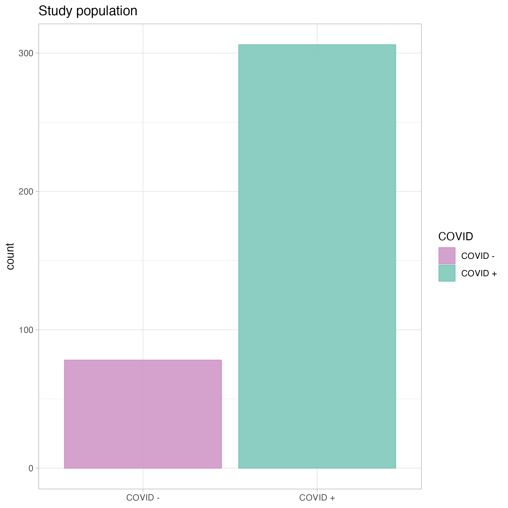

```{r setup, include=FALSE}
knitr::opts_chunk$set(echo = FALSE)
```


## Content

- Introduction to dataset
- Data cleaning
- Study population
- Modeling


## Introduction

*Longitudinal study with 306 COVID-19 patients and 78 symptomatic controls
*Identifying immune and non-immune proteins linked to COVID - 19


## Data cleaning

*Data:
  - Metadata: `r data_overview["n_patients"]` patients  with clinical information
  - Olink Proteomics: `r n_proteins` unique proteins

*Not all samples passed the Quality Control, those were removed:
`r data_overview["QC"]``


## Slide with Plot

```{r pressure}
plot(pressure)
```

## Study Population

```{r eval=FALSE, fig.align='left', include=FALSE, out.width='50%'}
knitr::include_graphics("../results/metadata_overview_acuity_age.png")



```

## Modeling (PCA)

```{r eval=FALSE, fig.align='left', include=FALSE, out.width='50%'}


knitr::include_graphics("../results/pca_age.png")
```

## Modeling (Volcano plot)

```{r eval=FALSE, fig.align='left', include=FALSE, out.width='50%'}

knitr::include_graphics("../results/volcano_plot.png") 
```

## Modeling (Heatmap)

```{r eval=FALSE, fig.align='left', include=FALSE, out.width='50%'}

knitr::include_graphics("../results/heatmap_inflammation_panel.png") 

```

## Modeling (Boxplot)

```{r eval=FALSE, fig.align='left', include=FALSE, out.width='50%'}
knitr::include_graphics("../results/boxplot_inflammatory_markers.png")

```

