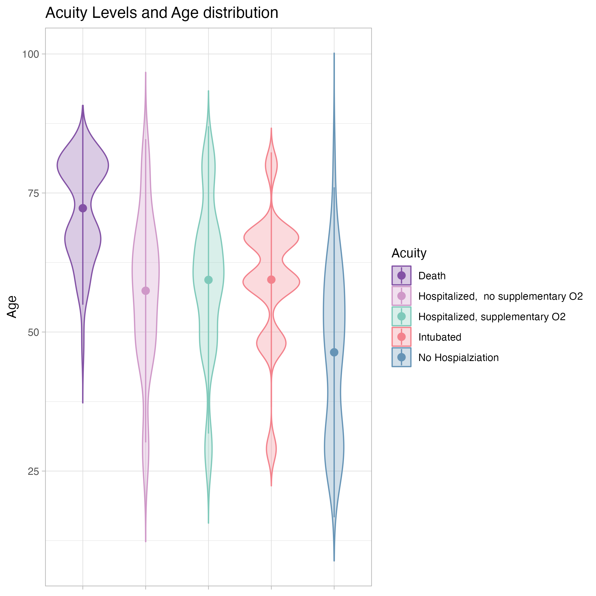
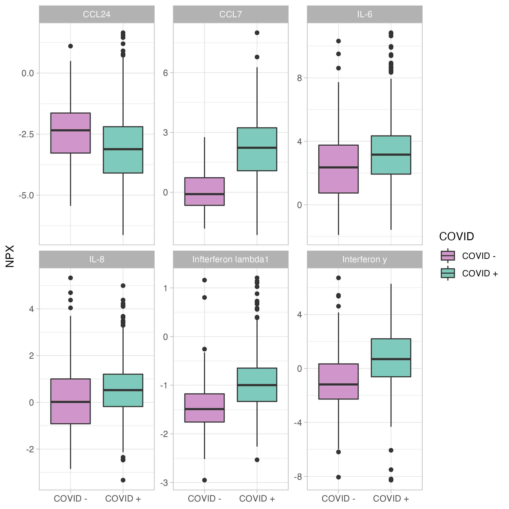
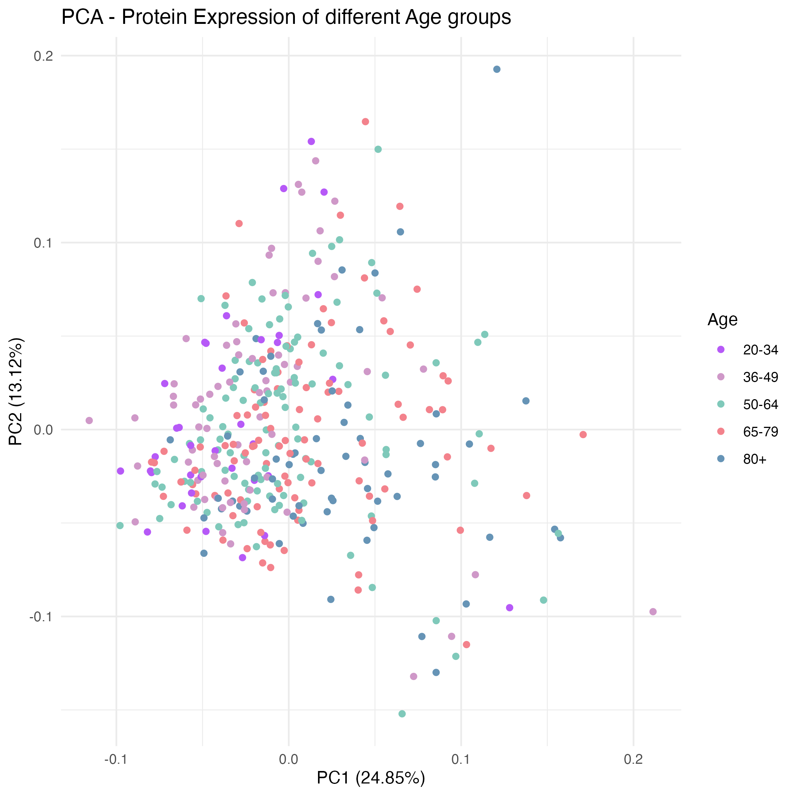

```{r setup, include=FALSE}
knitr::opts_chunk$set(echo = FALSE)
```


## Content

* Introduction to Dataset

Patient medical data (subject_id, age, acuity, …)
Proteomics (Olink Assay)

* Data Cleaning

* Study Population (Bar plot & Violin plot)

* Modeling (PCA, Volcano plot & Heatmap)


## Introduction

* Longitudinal study with 306 COVID-19 patients and 78 symptomatic controls
* Identifying immune and non-immune proteins linked to COVID - 19

```{r}
knitr::include_graphics("fig/publication_title.png")
```

## Study Aim / Methods / Results

* Covid-19 : > 1 million cases
* Immune dysfunction (hyper- & hypo- immune response)
* Limited of sample size or narrow set of immune mediators
* Plasma proteomics 

* To gain insights into underlying disease mechanisms, researchers map proteomics (n=1,472) to specific cell types in the context of relevant clinical phenotypes.

* Plasma collection and processing (in patients (n=306) vs controls = 78)
* Olink plasma proteomic assays
* Quality control (Olink)

 
## Olink Assay
* Protein biomarker panels:
early diagnosis, prognosis, patient stratification 
or monitoring treatment response
* Proximity Extension Assay (PEA)
* Fluorescence intensity
* Panels i.e. Inflammation


## Data cleaning

```{r}
#| out.width = '80%', 
#| include = TRUE
knitr::include_graphics("fig/data_cleaning_schme.png")
```


## Study Population

```{r}
knitr::include_graphics("../results/metadata_overview_covid.png")

```


## Volcano Plot

```{r}
#| fig.cap = "Volcano Plot: COVID postive vs. COVID negative, baseline",
#| out.width = '50%', 
#| fig.align = 'center',
#| include = TRUE
knitr::include_graphics("../results/volcano_plot.png") 
```

## Inflammatory Markers 

```{r}
#| fig.cap = "Inflammatory Markers: COVID postive vs. COVID negative, baseline",
#| include = TRUE,
#| fig.align = 'center'

```

## Clustering PCA

```{r}
knitr::include_graphics("../results/pca_covid.png")

```

## Heatmap

```{r}
#| fig.cap = "Heatmap Inflammation Panel, Baseline Samples",
#| out.width = '40%', 
#| fig.align = 'center',
#| include = TRUE
 
```

